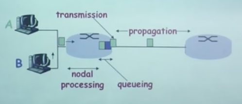

### 1.2 接入网

1. DSL 分成不同的速率 如上行和下行
2. 光线电缆 FTTH 

### 1.3 网络核心

- **分组交换中** 端到端对message 传输靠着packet switch 主要为：
  
  1. router
  2. link-layer switch
  
- store and forward transmission（储存转发传输）：需要switch完整接受到一份分组 才能开始传输

  ​    端到端一个分组的传输时延：

  ​                             **d=N*(L/R)** ,   where N为#linker N-1个swtich

  

- 排队和分组loss

   存在delay 原因是switch的缓存大小有限 可能会导致packet loss

​    	链路message到达switch的速度大于交换的速率 也会导致排队时延

- forwarding table和protocol

  ​	举不会用地图的司机在问路的例子 来类比ip address

- 电路交换（略）

#### 1.3.3 网络的网络

举例五层网络结构 循序渐进

### 1.4 分组交换网中的时延，丢包（packet loss）和吞吐量（througput）（视频）

#### ***<u>概念与补充</u>***

##### 信道容量

TraceRt测试：RTT round trip time 往返延迟

​		ICMP 协议 控制报文

​		TTL 生存时间 过一个路由器 ttl减一个 为零时候报告原主机

##### UDP TCP和以太网关系

> UDP 和 TCP 都是在以太网上工作的传输层协议，但它们提供不同的特性和功能。TCP 提供可靠性和流控制，适用于那些需要可靠传输的应用，而 UDP 则更适合对实时性要求较高且能容忍丢失一些数据的应用。

----

- 四类分组延时
  1. 节点处理延时 nodal proceeding
  2. 排队延时 queneing
     - 取决于intensity   [0,1]  *公式* 带宽 i=1的时候 延时无限大
  3. 传输延时 transmission
  4. 传播延时 propagation 有时距离短可以忽略不计

- 分组丢弃后怎么办？（缓存满了 也可能 ttl没了）
  1. 上路重新传
  2. 主机重新传
  3. udp（以太网 不可靠）--> 丢了就没了

- 吞吐量 throughput

  瓶颈取决于最小

  

  经过多跳

  

### 1.5 协议层次和分层模型

##### <u>*概念*</u>

大问题--->小问题

模块化 分层思想

PDU（protocol data unit） 协议数据单元：一个统称的概念 在每个层级中不一样

层间接口

服务：下层向上层提供服务

SDU PDU：服务数据单元和协议数据单元 

---

- ##### 服务用户和服务访问点

  ​	访问点：SAP

  ​	如套接字？加以标注和**区分** 从哪里来 到哪里去

  ​	原语 primitive： 提供服务的形势 *<u>具体看课件</u>*

  ​	举例子：用户通过SAP来告诉服务提供者 他需要什么服务 服务提供者通过primitive的形式来告诉用户我想你提供什么服务（如邮件，包裹的拆发）

- ##### 服务类型

  - 面向连接对服务（TCP）

    握手！做好资源分配和准备

    

  - 无连接的服务（UDP）

- ##### 和protocol的关系？

   <u>**下层为了满足上层的服务 需要通过协议来传输 协议的目的是为了更好的满足上层要求的服务**</u>

- ##### DU（数据单元）中SDU和PDU的关系？

   **<u>简述：第n+1层传递SDU到第n层 n层加上控制信息（header）封装变成PDU</u>**

   reality：更具PDU的大小有区分

应用层：数据报文message

传输层：报问段segment

网络层：分组 （无连接：数据报） datagram

链路层：数据帧 鉴定比特组合 传输以frame为单位的数据

物理层：位。。。

+ ##### Internet协议栈

+ 

应用层：HTTP FRP DNS

传输层：借助端口的机制 在主机到主机到基础上 来完成host的<u>进程到进程</u>的区分；把网络层提供的不可靠服务变成可靠

网络层：传输以分组为单位的端到端的传输

链路层：鉴定比特组合 传输相邻两点以frame为单位的数据 p2p

物理层：相邻两点的电磁波的转换

^^^^^^^^^^^^^^^^^^^^^^^^^^^^^^^^^^^^^^^^^^^^^^^^^^^^^^^

# Chapter 2 应用层

*概念*：

端口号，用于区分不同应用进程；tcpip中 都是16比特的大小

socket 套接字：TCP上为四元组，UDP为二元组；在本地上使用，由OS控制，<u>是本地应用层和传输层之间的约定，对方不懂，本地的其他层也不懂</u>

ICI：

-------

### 2.1 网络应用的体系结构

- #### cs模式

节点地位不同 可拓展性差 性能断崖式下降

服务器ip不变

- #### P2P系统 peer to peer

  角色可变 不同节点扮演不同角色 高可拓展性 如迅雷

+ 混合 **Napster**

​	目录查询cs 和 文件分发p2p

### 进程通讯（通过一对端节点end point）

要解决哪些问题？

1. 标识和寻址

2. 如何**应用层和传输层**提供具体信息？

3. 如何实现

- **标识和寻址**

  IP+**port** （端口号）

  port指出要求服务应用在哪个进程上运行；web应用默认在80号端口

- **哪些信息**

  SDU， header（控制，包括谁发的 发给谁 发的是什么）

  为了减少层间传输的传输量和便于管理，使用socket（一个整数）

  用于指明对话关系

  - 对于UDP

    二元组（本地IP+本地UDP的端口）

- **如何实现**？

######  应用层协议：公开和私有

根据应用场景来决定是用TCP还是UDP

###### 提供安全性？

###### SSL（在应用层）安全套接字层 在TCP之上 UDP提供安全服务 

例如https

